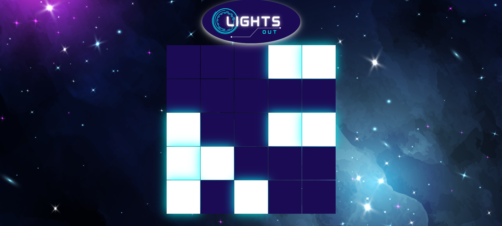

# React Lights Out



## Link to the game:

[Play me!](https://pasha-log.github.io/react-lights-out/)

## Decription: 

This is another assignment from Springboard's SWE track. The player's objective is to successfully turn off all the lit cells. Here is [an Wikipedia article going into depth](https://en.wikipedia.org/wiki/Lights_Out_(game)) 

## Tools used:

* React.js
* CSS

## Setup & Running

Created with [Create React App][cra].

1. Clone this repository

   ```bash
   git clone <link> <location>
   ```

1. Use the NPM scripts

   - Running in development mode

     ```bash
     npm run start
     ```

   - Create production build

     ```bash
     npm run build
     ```
